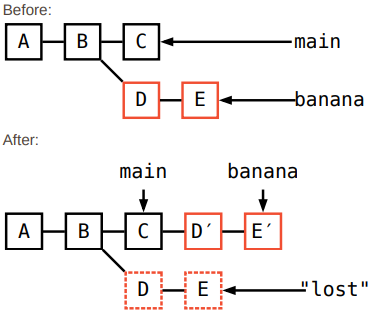
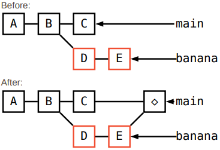
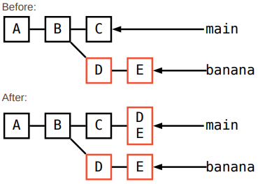
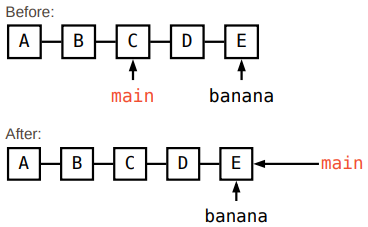
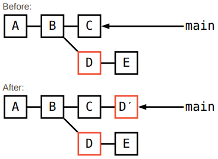

# Git Cheat Sheet

## Getting Started

| Command           | Discription            |
| ----------------- | ---------------------- |
| `git init`        | Start a new repo       |
| `git clone <url>` | Clone an existing repo |

## Prepare to Commit

| Command                  | Discription                                         |
| ------------------------ | --------------------------------------------------- |
| `git add <file>`         | Add untracked file or unstaged changes              |
| `git add .`              | Add all untracked files and unstaged changes        |
| `git add -p`             | Choose which parts of a file to stage               |
| `git mv <old> <new>`     | Move file                                           |
| `git rm <file>`          | Delete file                                         |
| `git rm --cached <file>` | Tell Git to forget about a file without deleting it |
| `git reset <file>`       | Unstage one file                                    |
| `git reset`              | Unstage everything                                  |
| `git status`             | Check what has been added                           |

## Make Commits

| Command                    | Discription                                           |
| -------------------------- | ----------------------------------------------------- |
| `git commit`               | Make a commit (and open text editor to write message) |
| `git commit -m 'message'`  | Make a commit                                         |
| `git commit -am 'message'` | Commit all unstaged changes                           |

## Move Between Branches

| Command                                            | Discription                                 |
| -------------------------------------------------- | ------------------------------------------- |
| `git switch <name>` OR `git checkout <name>`       | Switch branches                             |
| `git switch -c <name>` OR `git checkout -b <name>` | Create a branch                             |
| `git branch`                                       | List branches                               |
| `git branch --sort=-committerdate`                 | List branches by most recently committed to |
| `git branch -d <name>`                             | Delete a branch                             |
| `git branch -D <name>`                             | Force delete a branch                       |

## Diff Staged/Unstaged Changes

| Command             | Discription                          |
| ------------------- | ------------------------------------ |
| `git diff HEAD`     | Diff all staged and unstaged changes |
| `git diff --staged` | Diff just staged changes             |
| `git diff`          | Diff just unstaged changes           |

## Diff Commits

| Command                      | Discription                               |
| ---------------------------- | ----------------------------------------- |
| `git show <commit>`          | Show diff between a commit and its parent |
| `git diff <commit> <commit>` | Diff two commits                          |
| `git diff <commit> <file>`   | Diff one file since a commit              |
| `git diff <commit> --stat`   | Show a summary of a diff                  |
| `git show <commit> --stat`   | Show a summary of a diff                  |

## Discard Changes

| Command                                                                | Discription                                        |
| ---------------------------------------------------------------------- | -------------------------------------------------- |
| `git restore <file>` OR `git checkout <file>`                          | Delete unstaged changes to one file                |
| `git restore --staged --worktree <file>` OR `git checkout HEAD <file>` | Delete all staged and unstaged changes to one file |
| `git reset --har`                                                      | Delete all staged and unstaged change              |
| `git clean`                                                            | Delete untracked files                             |
| `git stash`                                                            | 'Stash' all staged and unstaged changes            |

## Edit History

| Command                                                   | Discription                                                     |
| --------------------------------------------------------- | --------------------------------------------------------------- |
| `git reset HEAD^`                                         | "Undo" the most recent commit (keep working directory the same) |
| `git rebase -i HEAD~6`                                    | Squash the last 5 commits into one                              |
| `git reflog BRANCHNAME`, then `git reset --hard <commit>` | Undo a failed rebase                                            |
| `git commit --amend`                                      | Change a commit message (or add a file you forgot)              |

## Code Archaeology

| Command                                                       | Discription                                                             |
| ------------------------------------------------------------- | ----------------------------------------------------------------------- |
| `git log main` / `git log --graph main` / `git log --oneline` | Look at a branch's history                                              |
| `git log <file> `                                             | Show every commit that modified a file                                  |
| `git log --follow <file>`                                     | Show every commit that modified a file, including before it was renamed |
| `git log -G banana`                                           | Find every commit that added or removed some text                       |
| `git blame <file>`                                            | Show who last changed each line of a file                               |

## Combine Diverged Branches

**Combine with rebase**

```
git switch banana
git rebase main
```



**Combine with merge**

```
git switch main
git merge banana
```



**Combine with squash merge**

```
git switch main
git merge --squash banana
git commit
```



**Bring a branch up to date with another branch (aka "fast-forward merge")**

```
git switch main
git merge banana
```



**Copy one commit onto the current branch**

```
git cherry-pick <commit>
```



## Restore an Old File

| Command                                                                  | Discription                                   |
| ------------------------------------------------------------------------ | --------------------------------------------- |
| `git checkout <commit> <file>` OR `git restore <file> --source <commit>` | Get the version of a file from another commit |

## Add a Remote

| Command                       | Discription |
| ----------------------------- | ----------- |
| `git remote add <name> <url>` |             |

## Push Changes

| Command                       | Discription                                             |
| ----------------------------- | ------------------------------------------------------- |
| `git push origin main`        | Push the main branch to the remote origin               |
| `git push`                    | Push the current branch to its remote "tracking branch" |
| `git push -u origin <name>`   | Push a branch that you've never pushed before           |
| `git push --force-with-lease` | Force push                                              |
| `git push --tags`             | Push tags                                               |

## Pull Changes

| Command                              | Discription                                           |
| ------------------------------------ | ----------------------------------------------------- |
| `git fetch origin main`              | Fetch changes (but don't change any local branches)   |
| `git pull --rebase`                  | Fetch changes and then rebase current branch          |
| `git pull origin main` OR `git pull` | Fetch changes and then merge them into current branch |

## Configure Git

| Command                            | Discription                     |
| ---------------------------------- | ------------------------------- |
| `git config user.name 'Your Name'` | Set a config option             |
| `git config --global ...`          | Set option globally             |
| `git config alias.st status`       | Add an alias                    |
| `man git-config`                   | See all possible config options |

## Important Files

| Command        | Discription             |
| -------------- | ----------------------- |
| `.git/config`  | Local git config        |
| `~/.gitconfig` | Global git config       |
| `.gitignore`   | List of files to ignore |
